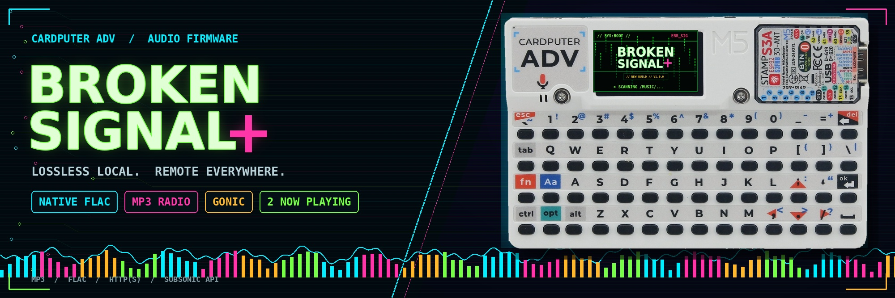

# BrokenSignal+

**A FLAC-focused music player, MP3 web radio, and Gonic/Subsonic client for the M5Stack Cardputer ADV.**

BrokenSignal+ is a firmware-only distribution derived from [Rythlan/BrokenSignal-Next](https://github.com/Rythlan/BrokenSignal-Next), which is itself a fork of [MarcoRR/BrokenSignal](https://github.com/MarcoRR/BrokenSignal).

The goal of this build is different from upstream: it replaces local M4A/AAC support with native FLAC playback, focuses web radio on stable MP3 streams, and adds remote Gonic libraries, multilingual menus, more themes, and two fullscreen theme-aware Now Playing layouts.

> **Current release:** [BrokenSignal+ v1.0.0](https://github.com/mr-f0xx/BrokenSignal-Plus/releases/tag/v1.0.0)
> **Hardware:** M5Stack Cardputer ADV
> **Repository format:** precompiled firmware only

---

## How BrokenSignal+ differs from upstream

The comparison below refers to the upstream **BrokenSignal-Next** project, not to older releases of this repository.

| Feature | Upstream BrokenSignal-Next | BrokenSignal+ |
|---|---|---|
| Local audio | MP3 and M4A/AAC-LC | MP3 and native FLAC |
| FLAC metadata | Not supported | Exact duration, sample rate, channels, and bit depth from FLAC `STREAMINFO` |
| FLAC seeking | Not supported | Sample-based seeking through libFLAC |
| Web radio | MP3 and AAC | MP3 over HTTP/HTTPS, with playlists and automatic reconnect |
| Remote music server | Not included | Gonic/Subsonic album browser and streaming client |
| Remote FLAC playback | Not included | Gonic transcodes FLAC to MP3 on the server before streaming |
| Audio buffering | Standard playback path | 32 KiB FLAC source buffer, deeper PCM queue, and enlarged I²S DMA reserve |
| Themes | 5 | 10 |
| Interface languages | English | English, Spanish, Italian, and French |
| Fullscreen player | No equivalent mode | Two selectable, theme-aware Now Playing interfaces with live audio animation |
| Diagnostics | Debug overlay | Debug overlay plus codec/FLAC information and network-buffer monitoring |
| Distribution | Source-based PlatformIO project | Ready-to-flash firmware-only repository |

### Intentional trade-offs

BrokenSignal+ is **not a drop-in codec superset** of upstream:

- Local **M4A/AAC support was removed** to prioritize native FLAC and reduce firmware complexity.
- Web radio is deliberately limited to **MP3 streams**. AAC, Ogg, M4A, and HLS (`.m3u8`) are not supported.
- Gonic FLAC playback requires **server-side MP3 transcoding**, normally provided through FFmpeg.
- The Cardputer audio path outputs 16-bit PCM, so 24-bit FLAC files are decoded but reduced to 16-bit at the speaker output.
- This repository distributes the compiled firmware and documentation, not the PlatformIO source tree.

---

## Main features

### Local MP3 and FLAC playback

- Browse nested folders under `/Music/`
- Native MP3 and FLAC decoding
- Exact FLAC duration and sample-based seeking
- Pause, resume, repeat-one, repeat-all, shuffle, and recent tracks
- Paginated browsing for large music libraries
- Intended FLAC profile: mono/stereo, 16-bit or 24-bit, at common rates including 44.1, 48, 88.2, and 96 kHz

### FLAC stability pipeline

The local FLAC path was redesigned for the Cardputer ADV's limited memory and lack of PSRAM:

1. microSD source
2. 32 KiB compressed-data buffer
3. libFLAC decoder
4. three 2,048-frame PCM blocks
5. M5Unified `playRaw` queue
6. I²S DMA configured as 8 × 512 frames

Display updates and visualizer sampling are reduced or disabled during normal local playback to avoid audio starvation. PCM visualizer collection is enabled only while the fullscreen visualizer is open.

### MP3 web radio

- HTTP and HTTPS MP3 streams
- Simple `.m3u` and `.pls` playlist resolution
- 48 KiB network jitter buffer with prebuffering
- Automatic reconnect with progressive delay
- ICY station-name detection
- Wi-Fi selection and password entry directly on the Cardputer

### Gonic / Subsonic

Press `G` to configure a Gonic-compatible server from the device:

- Server URL, username, and password entry
- Salted Subsonic token authentication
- Paginated album browsing
- Track listing and continuous album playback
- Server-side conversion to MP3 at 192 kbps, including FLAC sources

Use HTTPS if the server is reachable over the internet. Gonic and Wi-Fi credentials are stored in plain text on the microSD card.

### Fullscreen Now Playing visualizers

Press `V` to open or close the fullscreen player. Two native 240 × 135 Now Playing layouts can be selected directly in Settings.

The **Vinyl Player** layout includes:

- animated spinning vinyl record and tonearm;
- live smoothed spectrum strip;
- volume level, shuffle/repeat states, and battery percentage;
- track title, inferred artist/folder information, and active codec;
- playback progress, elapsed/total time, queue position, and transport state;
- automatic use of all colors from the currently selected firmware theme;
- flicker-resistant incremental rendering: the interface never clears a full frame, vinyl highlights are updated in place, and LCD writes are grouped into a single transaction.

The second **Retro Deck** layout reproduces the supplied orange digital-player composition with a framed status bar, artist and large track title, codec badges, shuffle/repeat indicators, U-shaped animated spectrum, volume/dB line, elapsed and total time, and a compact progress bar. Its colors map automatically to the selected firmware theme.

The `Visualizer` row in Settings switches between `Vinyl Player` and `Retro Deck`; the selection is saved to the microSD settings file.

Fullscreen visualizers and PCM spectrum sampling are disabled while the Web Radio or Gonic interface is active. This reserves CPU and buffering capacity for network-stream decoding; the `V` shortcut is intentionally ignored in radio mode.

For FLAC stability, the player does not allocate a fullscreen sprite. The header, vinyl and progress areas are refreshed independently, leaving the decoder heap available to libFLAC.

### New BrokenSignal+ boot identity

The original matrix/glitch boot background is preserved, but the former `BROKEN SIGNAL NEXT` mark is replaced by the banner-style `BROKEN SIGNAL+` logo. A `NEW BUILD` and version marker makes the new generation immediately recognizable at power-on.

### Interface customization

The music-browser header has been cleaned across all themes: the legacy `H` hint and decorative right-side separator have been removed while the track counter remains visible.

- 10 color themes, selected with `1`–`0`
- English, Spanish, Italian, and French menus
- Adjustable brightness
- Optional automatic screen-off timer
- Adjustable seek interval
- Wi-Fi power-saving option

---

## Installation

Download these files from the [v1.0.0 release](https://github.com/mr-f0xx/BrokenSignal-Plus/releases/tag/v1.0.0):

- `BrokenSignal-Plus-v1.0.0.bin`
- `SHA256SUMS.txt`

### M5Launcher

Copy the full `.bin` file to the microSD card and launch it with M5Launcher.

### esptool

The release file is a complete flash image and must be written at address `0x0`:

```bash
esptool.py --chip esp32s3 --port YOUR_PORT erase_flash
esptool.py --chip esp32s3 --port YOUR_PORT --baud 460800 \
  write_flash 0x0 BrokenSignal-Plus-v1.0.0.bin
```

### Verify the download

```bash
sha256sum -c SHA256SUMS.txt
```

Expected SHA-256:

```text
98281b933474c078383a358741e1abff79347c734189ed70c4aa6a45a56e5c07
```

---

## microSD layout

```text
/Music/
├── Album One/
│   ├── 01 - Track.mp3
│   └── 02 - Lossless Track.flac
├── settings.cfg
├── _radio/
│   ├── wifi.cfg
│   └── webradio.cfg
└── _gonic/
    └── gonic.cfg
```

The configuration directories are created automatically and hidden from the local music browser.

---

## Controls

| Key | Action |
|---|---|
| `ENTER` | Open a folder/album or play the selected track/station |
| `DEL` | Go back |
| `SPACE` | Pause/resume local audio or play/stop a network stream |
| `;` / `.` | Move selection up/down |
| `,` / `/` | Seek backward/forward or change page |
| `+` / `-` | Volume |
| `W` | Open MP3 web radio |
| `G` | Open Gonic/Subsonic |
| `V` | Open/close fullscreen visualizer |
| `M` | Settings |
| `D` | Diagnostics |
| `H` | Context-sensitive help |
| `O` | Screen on/off |
| `1`–`0` | Select one of ten themes |

---

## Known limitations

- No local AAC, M4A, Ogg, or multichannel FLAC playback
- No AAC/Ogg/HLS web radio
- No embedded cover-art display
- HTTPS certificate verification is relaxed for compatibility with private/self-hosted servers
- Credentials are stored unencrypted on the microSD card
- Real-world stability depends on Wi-Fi quality, microSD performance, and Gonic/FFmpeg configuration

---

## Credits and licensing

BrokenSignal+ is based on the work of:

- [MarcoRR/BrokenSignal](https://github.com/MarcoRR/BrokenSignal) — original project
- [Rythlan/BrokenSignal-Next](https://github.com/Rythlan/BrokenSignal-Next) — Cardputer ADV and PlatformIO fork
- [ESP8266Audio](https://github.com/earlephilhower/ESP8266Audio) — MP3/FLAC decoding components
- [M5Stack](https://github.com/m5stack) — Cardputer and M5Unified libraries

Distributed under the MIT License. See [LICENSE](LICENSE).
